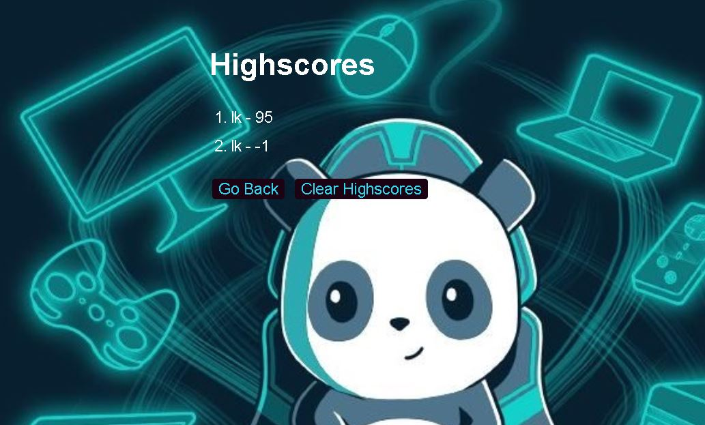

# The point of this project is to see that I utilize what I learn this week and various week

* I will be using Web API scripts for my survey

* I will be inputting some basic question

* My goal is to make it simple but to make it work, this will be my foundation on learning to do a more detail survey in the future for any company.

* I need to my sure my if and else, which I want to sue switch, case, and break, because I found it easier learning about in the online classes that were suggested by the professor/

* I will do some css to my website to make more lively looking.

* My main goal is the it stores the data locally and displays it

